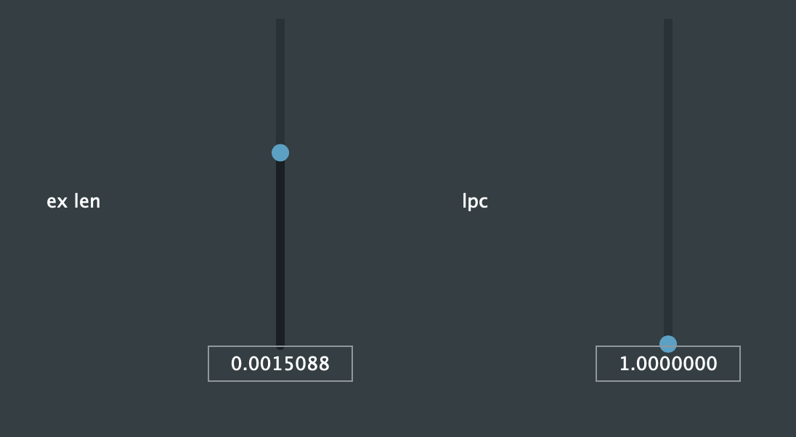

# Real-time Linear Predictive Coding (LPC)

White noise excitation source, supports stereo processing. The plugin to be run is "voicemorph.vst3".

Certain input may cause the output to clip. Thus, input and output gain control knobs are included.

Background:

* Linear predictive coding: Chapter 7 of [ADSP Notes](https://course.ece.cmu.edu/~ece792/) by Richard Stern
* [Levinson Durbin Recursion](http://www.emptyloop.com/technotes/A%20tutorial%20on%20linear%20prediction%20and%20Levinson-Durbin.pdf)

To be expanded with more functionalities.
